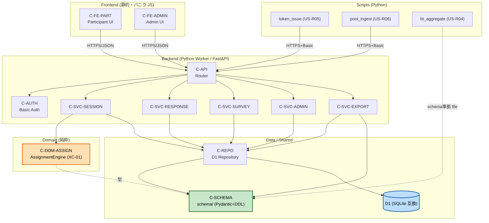

# Component Dependency — nazokake-judge

## 依存マトリクス（→ は「依存する / 呼び出す」）

| From \ To | API | AUTH | SESSION | RESPONSE | SURVEY | ADMIN | EXPORT | ASSIGN | REPO | SCHEMA |
|---|---|---|---|---|---|---|---|---|---|---|
| C-FE-PART | ● | | | | | | | | | |
| C-FE-ADMIN | ● | | | | | | | | | |
| C-API | | ● | ● | ● | ● | ● | ● | | | |
| C-AUTH | | | | | | | | | | |
| C-SVC-SESSION | | | | | | | | ● | ● | |
| C-SVC-RESPONSE | | | ○ | | | | | | ● | |
| C-SVC-SURVEY | | | | | | | | | ● | |
| C-SVC-ADMIN | | | | | | | | | ● | |
| C-SVC-EXPORT | | | | | | | | | ● | ● |
| C-DOM-ASSIGN | | | | | | | | | | ○ |
| C-REPO | | | | | | | | | | ● |
| C-SCRIPT-TOKEN | ● | | | | | | | | | ● |
| C-SCRIPT-POOL | ● | | | | | | | | | ● |
| C-SCRIPT-BT | | | | | | | | | | ● |

（● = 直接依存 / ○ = 型・データのみ参照。C-AUTH は C-API がミドルウェアとして適用）

**要点**
- ドメイン（C-DOM-ASSIGN）は Service/Repo に依存しない**純粋関数**（依存の向きが内側）。
- scripts/（token_issue/pool_ingest）は **C-SCHEMA を共有**し、**実行時の D1 アクセスは Worker 管理 API（C-API, Basic 認証）経由**（H-1=(c) 確定, U1 Infrastructure Design）。C-REPO は Worker 内専用。
- C-SCRIPT-BT は DB に直接依存せず、ExportService 出力（schema/ 準拠）を入力に取る（US-R02↔R04）。

---

## 通信パターン

| 経路 | プロトコル/方式 | 認証 |
|---|---|---|
| Participant UI → Backend | HTTPS / JSON（REST） | なし（トークンで識別） |
| Admin UI → Backend | HTTPS / JSON（REST） | Basic 認証（Q5=B） |
| Backend → D1 | D1 バインディング / パラメータ化クエリ | — |
| scripts/ → Worker 管理 API → D1 | **確定（H-1=(c)）**: 実行時の D1 アクセスは Worker に集約。token_issue/pool_ingest は Worker 管理エンドポイントを叩く（HTTPS/JSON） | Basic 認証 |
| scripts/bt_aggregate ← Export | ファイル（CSV/JSON, schema/ 準拠） | — |

> **✅ H-1 確定（U1 Infrastructure Design, 2026-07-12）= 案 (c)**: 実行時の `scripts/ → D1` アクセスは **Worker に Basic 認証背後の管理用エンドポイントを設け token_issue/pool_ingest がそれを叩く**方式に確定。依存マトリクスの `C-SCRIPT-TOKEN / C-SCRIPT-POOL` は `→ C-REPO` から **`→ C-API`** に更新済み。C-REPO は Worker 内専用。なお **DDL 適用（`wrangler d1 migrations`）はデプロイ時操作**であり本原則（実行時アクセスの Worker 集約）の例外ではない。詳細は `construction/u1/infrastructure-design/infrastructure-design.md` §4、`construction/shared-infrastructure.md`。

---

## 依存グラフ / データフロー

---

## トレーサビリティ（ストーリー → コンポーネント）

| ストーリー | 主担当コンポーネント |
|---|---|
| US-P01 アクセス | C-FE-PART, C-SVC-SESSION, C-REPO |
| US-P02 教示・練習 | C-FE-PART, C-SVC-SESSION |
| US-P03 判定送信 | C-FE-PART, C-SVC-RESPONSE, C-REPO |
| US-P04 進捗 | C-FE-PART, C-SVC-SESSION |
| US-P05 Likert | C-FE-PART, C-SVC-SURVEY |
| US-P06 アンケート | C-FE-PART, C-SVC-SURVEY |
| US-P07 完了 | C-SVC-SESSION |
| US-P08 再開 | C-SVC-SESSION, C-REPO |
| US-R01 進捗 | C-FE-ADMIN, C-SVC-ADMIN, C-AUTH |
| US-R02 エクスポート | C-SVC-EXPORT, C-SCHEMA, C-AUTH |
| US-R03 暫定勝率 | C-FE-ADMIN, C-SVC-ADMIN |
| US-R04 BT 集計 | C-SCRIPT-BT, C-SCHEMA |
| US-R05 トークン発行 | C-SCRIPT-TOKEN |
| US-R06 プール投入 | C-SCRIPT-POOL |
| XC-01 割当 | C-DOM-ASSIGN, C-SVC-SESSION |
| XC-02 状態ラウンドトリップ | C-SVC-SESSION, C-REPO |
| XC-03 セキュリティ衛生 | C-AUTH, C-REPO, C-API |
| XC-04 モバイル/日本語 | C-FE-PART |
