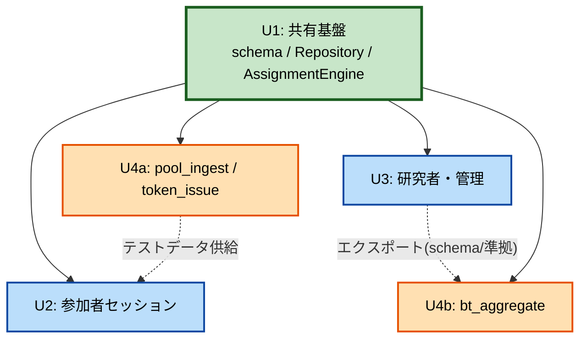

# Unit of Work Dependency — nazokake-judge

## 依存マトリクス（→ は「依存する」）

| From \ To | U1 基盤 | U2 参加者 | U3 研究者管理 | U4 スクリプト |
|---|:---:|:---:|:---:|:---:|
| **U1 基盤** | — | | | |
| **U2 参加者** | ● | — | | |
| **U3 研究者管理** | ● | | — | |
| **U4 スクリプト** | ● | | ○（U4b のみ: エクスポート形式） | — |

- ● = コード/実行時依存 / ○ = データ形式（ファイル）依存
- **U1 はいずれにも依存しない**（基盤・一方向依存の起点、層の逆流禁止）。
- U4b（bt_aggregate）は U3 のエクスポート出力（schema/ 準拠ファイル）を入力に取る＝形式依存。

## 依存グラフ

## 実装順序（依存に基づく）

`U1 → U4a → U2 → U3 → U4b`

| 段階 | ユニット | 前提 |
|---|---|---|
| 1 | U1 基盤 | なし |
| 2 | U4a（投入・発行） | U1（接続方式は H-1 で確定） |
| 3 | U2 参加者 | U1 + U4a（実データで判定フロー確認） |
| 4 | U3 研究者管理 | U1（+ U2 で蓄積したデータ） |
| 5 | U4b（BT 集計） | U1 + U3 のエクスポート形式 |

## 横断関心（複数ユニットに跨る制約）

| 制約 | 主担当ユニット | 波及 |
|---|---|---|
| XC-01 割当（露出均衡・層間比率） | U1 | U2（セッション開始で呼出） |
| XC-02 状態ラウンドトリップ | U1 | U2（再開） |
| XC-03 セキュリティ衛生 | U1（SQLi）, U3（Basic 認証） | U2/U3 API（CORS）, U4a（トークン推測困難性） |
| XC-04 モバイル/日本語 | U2 | U3（管理 UI） |
