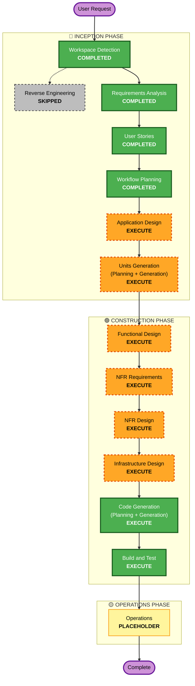

# Execution Plan — nazokake-judge

**作成日**: 2026-07-12
**プロジェクト種別**: Greenfield

## Detailed Analysis Summary

### Change Impact Assessment
- **User-facing changes**: Yes — 参加者の判定 UI（モバイルファースト）と研究者の管理画面
- **Structural changes**: Yes — 新規アーキテクチャ全体（フロント / バックエンド / DB / スクリプト）
- **Data model changes**: Yes — トークン、作品（層ラベル付き）、ペア判定、Likert、事後アンケート、セッション状態
- **API changes**: Yes — 回答送信、セッション取得・再開、進捗、エクスポート
- **NFR impact**: Yes — 基本セキュリティ衛生（NFR-04）、PBT Partial（NFR-07）、モバイル/日本語（NFR-02/03）

### Risk Assessment
- **Risk Level**: Medium — 技術的難度自体は低いが、**ペア割当ロジックの正しさが BT 推定（研究妥当性）に直結**するため品質リスクは中。割当の偏りは推定を汚染する（XC-01）。
- **Rollback Complexity**: Easy — Greenfield、外部依存の作り込みなし
- **Testing Complexity**: Moderate — PBT 重点（割当ロジックの不変条件 / セッション状態のラウンドトリップ）

## Workflow Visualization

## Phases to Execute

### 🔵 INCEPTION PHASE
- [x] Workspace Detection (COMPLETED)
- [x] Reverse Engineering (SKIPPED — Greenfield、既存コードなし)
- [x] Requirements Analysis (COMPLETED)
- [x] User Stories (COMPLETED)
- [x] Workflow Planning (IN PROGRESS)
- [ ] Application Design — **EXECUTE**
  - **Rationale**: 新規コンポーネント多数（判定 UI / 管理画面 / バックエンド API / DB / 割当ロジック / 集計・投入・発行スクリプト）。**アーキテクチャ案 A/B の比較決定**（requirements §6）と、XC-01 の割当関数シグネチャ `(プール, 露出カウント, シード) → ペア列` の設計をここで確定する。
- [ ] Units Generation — **EXECUTE**
  - **Rationale**: フロント / バックエンド / スキーマ / スクリプトの複数モジュール、複雑な割当ロジックとデータモデルを含み、並行開発可能な作業単位への分解が有益。

### 🟢 CONSTRUCTION PHASE（各ユニットごとに per-unit ループ）
- [ ] Functional Design — **EXECUTE**
  - **Rationale**: 新データモデル（トークン / 層ラベル付き作品 / 判定 / セッション状態）と複雑な業務ロジック（割当・BT・中断再開）。PBT-01 の property identification をここで行う。
- [ ] NFR Requirements — **EXECUTE**
  - **Rationale**: 基本セキュリティ衛生、モバイル/日本語、**PBT フレームワーク選定（PBT-09）** と技術スタック決定が必要。
- [ ] NFR Design — **EXECUTE**
  - **Rationale**: NFR Requirements を実行するため、対応する設計パターンの落とし込みが必要。
- [ ] Infrastructure Design — **EXECUTE**
  - **Rationale**: デプロイアーキ（案 A: Workers+D1 / 案 B: PHP+SQLite）、実験用サブドメイン分離のマッピング。
- [ ] Code Generation — **EXECUTE (ALWAYS)**
  - **Rationale**: 実装計画とコード生成。PBT-02〜10 のテスト生成を含む。
- [ ] Build and Test — **EXECUTE (ALWAYS)**
  - **Rationale**: ビルド・テスト・検証。PBT-08（シード記録・CI 統合）を含む。

### 🟡 OPERATIONS PHASE
- [ ] Operations — PLACEHOLDER
  - **Rationale**: 将来のデプロイ・監視ワークフロー（実験運用・データ回収は本アプリの利用フェーズで実施）。

## Estimated Timeline
- **Total Stages（実行）**: Inception 残り 2（AD, UG）+ Construction（per-unit × ユニット数 + Build and Test）
- **Estimated Duration**: ユニット数は Units Generation で確定。各ステージは承認ゲート付きの対話で進行するため、実時間はレビュー速度に依存。

## Success Criteria
- **Primary Goal**: なぞかけ品質を BT モデルで測る人間評価 Web アプリと、その集計・運用スクリプト一式を、実験運用可能な状態で構築する。
- **Key Deliverables**: 参加者判定アプリ（US-P01〜08）、研究者機能（US-R01〜06）、割当ロジック（XC-01）、オフライン BT 集計スクリプト、DB スキーマ。
- **Quality Gates**:
  - XC-01（露出均衡・層間比率、全体不変条件）を PBT-03 で検証
  - XC-02（セッション状態ラウンドトリップ）を PBT-02 で検証
  - XC-03（基本セキュリティ衛生: HTTPS / トークン推測困難性 / SQLi 対策 / CORS）
  - US-R02 エクスポート形式と US-R04 集計スクリプト入力形式の一致
